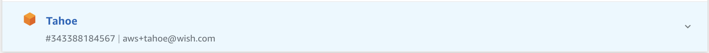
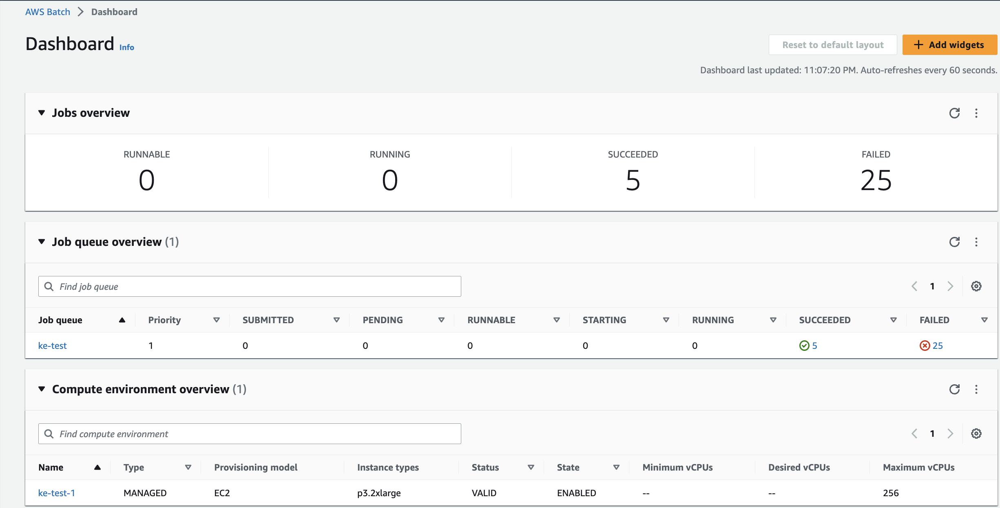
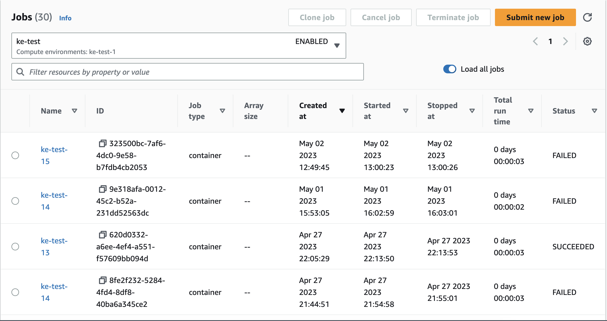
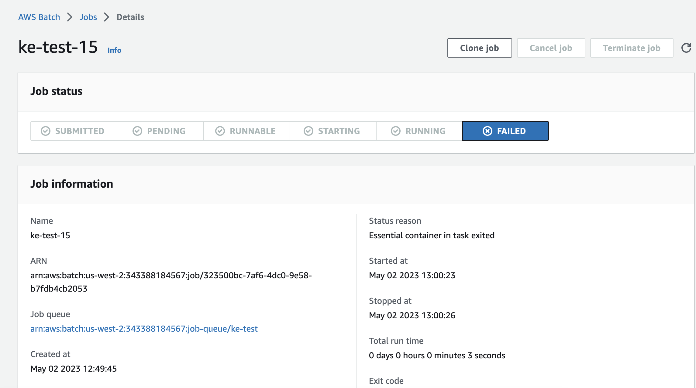
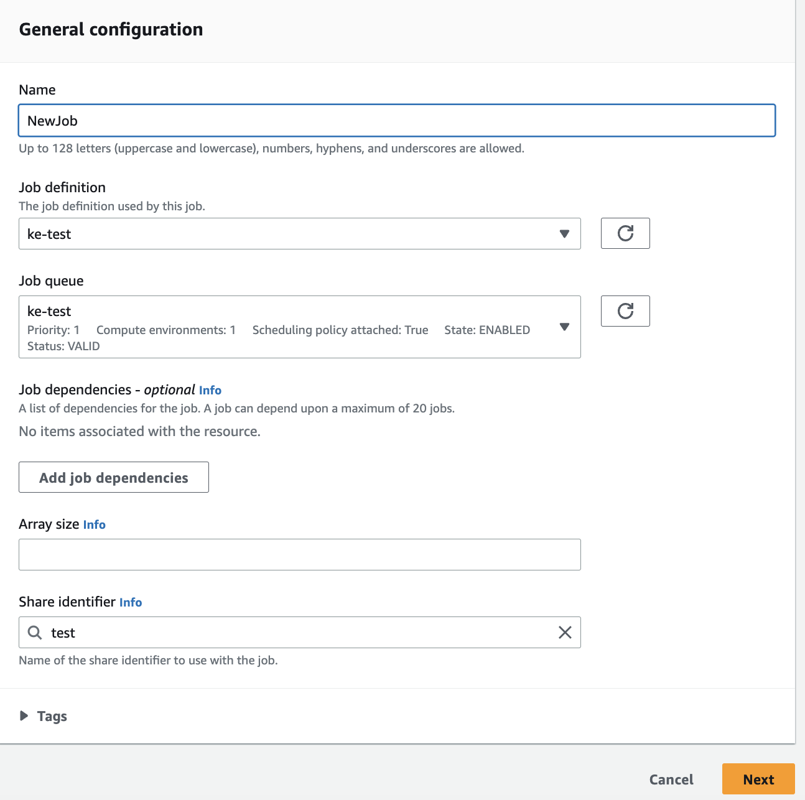
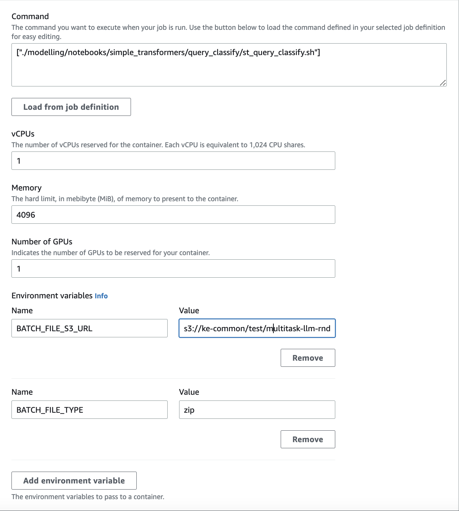
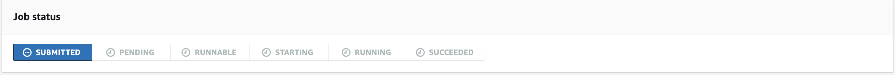
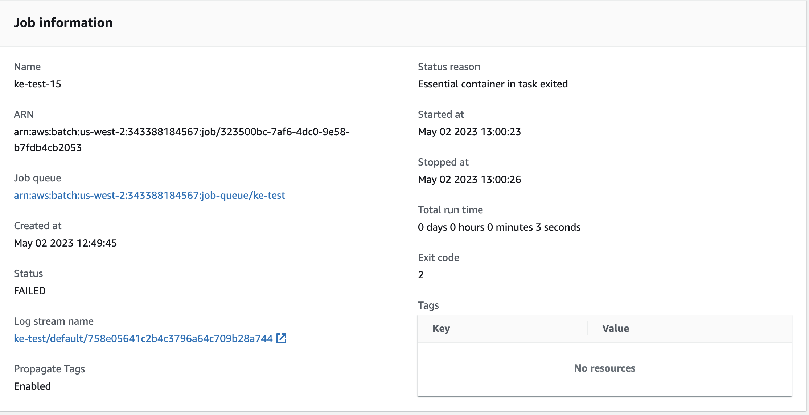

## How to submit a Batch Job.

### Preq:
	- AD account for tahoe access is set up. More info https://jira.wish.site/browse/IS-3507

	- You have write permissions for ***s3://ke-common*** bucket


## How to upload code snapshot to S3 bucket
```
./upload_code.sh <branch> <s3_url>
```
e.g
```
./upload_code.sh master s3://ke-common/test/
```


## Schedulling a Batch job.

- Login to your AD account by selecting ***AWS IAM Identity Center*** from okta app dashboard in your browser, and click on Tahoe env -> Management Console



- Switch region to ***us-west-2***, go to ***AWS Batch > Dashboard*** 
- You should see overview of Jobs, Job queues, and Compute env



- Select ***Jobs*** from left pane, make sure ***Load all jobs*** is enabled



- Select any job (latest preferred), and click on ***Clone job***



- Select appropriate job name, keep ***Job definition*** and ***Job queue*** and ***Share identifier*** as it is.



- On the next page make sure ***Command*** is set to your job script (uploaded inside the archive on S3 earlier)
- ***BATCH_FILE_S3_URL*** set full path to archive location in the s3 bucket
- ***BATCH_FILE_TYPE*** set to ***zip***



- Go ***Next > Create Job***
- You should see the ***Job status*** screen next



- Wait till the job status changes to ***RUNNING***, then the job logs should be availabe from ***Log scream name*** link on ***Job information*** pane




